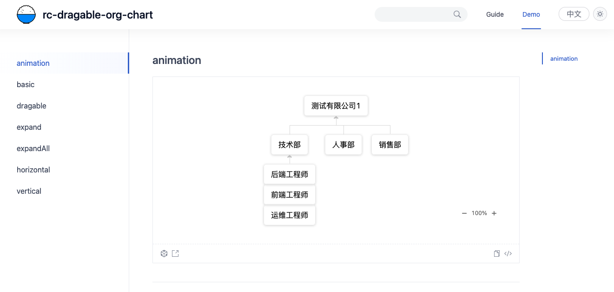

# rc-dragable-orag-chart

## Demo

[Demo](https://lllyin.github.io/rc-dragable-org-chart/)



## Getting Started

Install dependencies,

```bash
$ npm i
```

Start the dev server,

```bash
$ npm start
```

Build documentation,

```bash
$ npm run docs:build
```

Run test,

```bash
$ npm test
```

Build library via `father-build`,

```bash
$ npm run build
```
